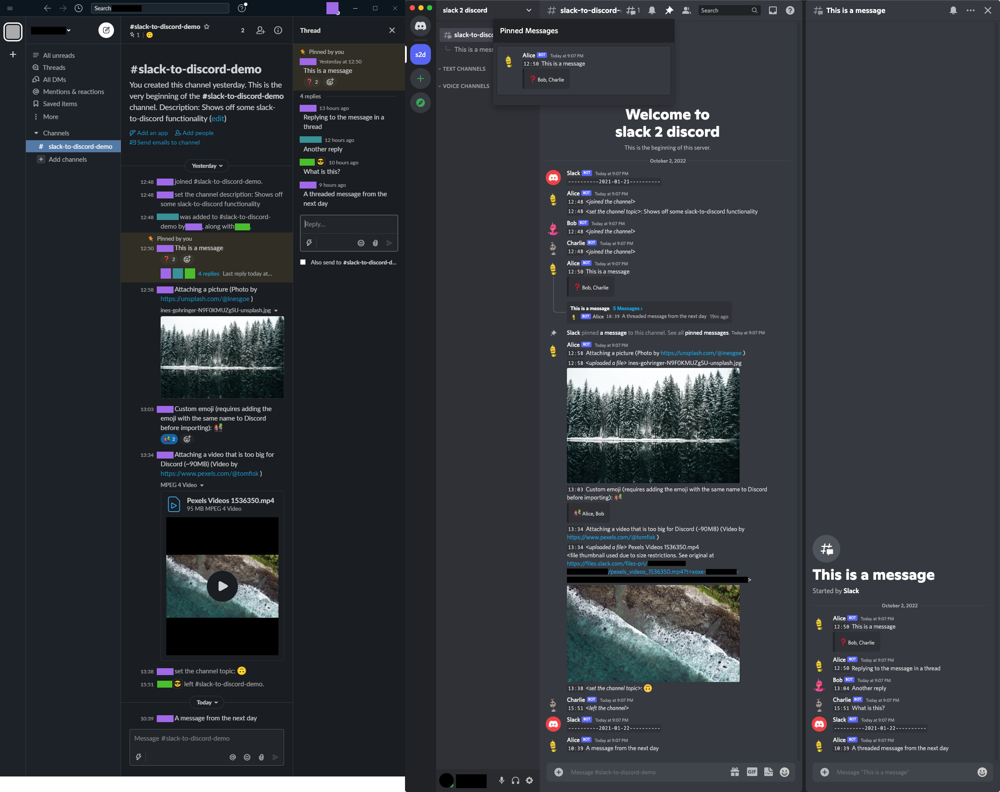

slack-to-discord
================

This tool takes a Slack export file and imports it into a Discord server

Capabilities
------------
- Imports complete message history (tested with an import of just over 10,000 messages).
- Handles private channels (if they're included in your Slack export).
- Handles images and other files (falls back to linking to the files hosted by Slack if they're too
  big to upload).
- Preserves the original names and avatars of the Slack users
- Preserves emojis and reactions to messages (custom emojis will work, but need to be manually added
  to Discord before importing).
- Preserves threaded conversations.
- Preserves pinned messages.
- Day boundaries between messages are marked by a `--------YYYY-MM-DD--------` message and each
  message is prefixed by the time it was sent.
- Messages that are too long for Discord (>2000 characters) are split up and sent as multiple
  smaller messages.

Limitations
-----------
- Messages will be timestamped by Discord as the time they were imported, not as the time they were
  originally sent. This is worked around by adding a timestamp to the text of each message.
- No private messages will be imported
- Reactions to messages will be shown in a custom embed, not as normal reactions
- No embeds from Slack (can contain images, buttons, etc) will be preserved.
- File uploads will be done in two messages. The first is the message content, the second is a
  message containing the title of the uploaded file and attaching it.

General recommendations
-----------------------
The program will read all messages from the Slack export and use a bot to post them in a Discord
server. It's recommended to start with a completely clean server before importing history. As the
script can only post messages, not rewrite history, any previous content will be buried by the
imported data. It's also a good idea to make sure everything worked properly before inviting other
users.

Private channels (if you can manage to export them from Slack) will be created such that only the
bot and guild administrators can access them. After the import completes and you invite your users,
you will need to manually change the roles/permissions to give everyone access to the correct
channels.

If something goes wrong with the import, you can delete all the created channels to quickly remove
the history. At this point, you can either fix the issue yourself and re-run the export (please
contribute your fixes back to the project!), or open an issue on the project.

Instructions
------------
1. Export your data from Slack via <https://my.slack.com/services/export>
2. Create a Discord bot (see <https://discordpy.readthedocs.io/en/latest/discord.html>) with the
   following permissions:
    - Manage Channels - to create the imported channels and change the topics of them
    - Manage Webhooks - to allow the bot to fake the usernames and avatars of Slack users
    - Send Messages
    - Create Public Threads
    - Send Messages in Threads
    - Embed Links - to add reactions to messages (see 'Limitations' section)
    - Attach Files
    - Manage Messages - to pin messages [optional]
3. Install `slack-to-discord` using `pip` (`pip install slack-to-discord`)
4. Run `slack-to-discord --zipfile <slack export zip> --guild <guild name> --token <bot token>`
   (check `slack-to-discord --help` for other options).
5. Wait. The program will exit once the import is finished. Due to Discord rate limits, the import
   process will take a while (speed was roughly 50 messages/min for me)
6. Inspect the imported history.
7. Invite your users.
